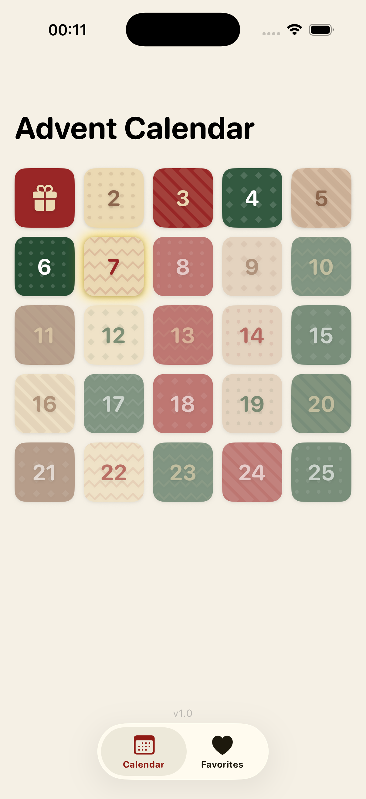
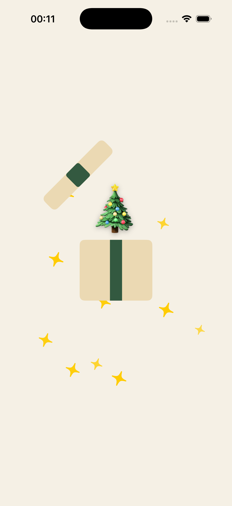
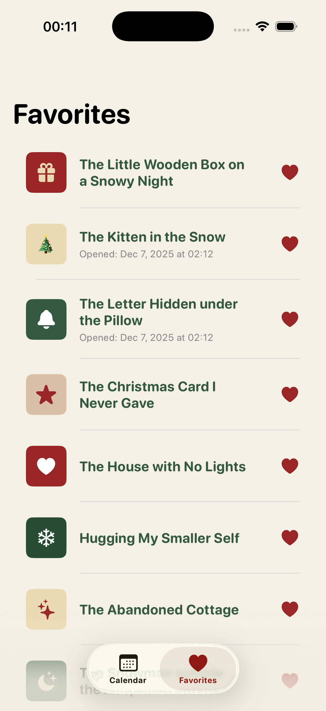
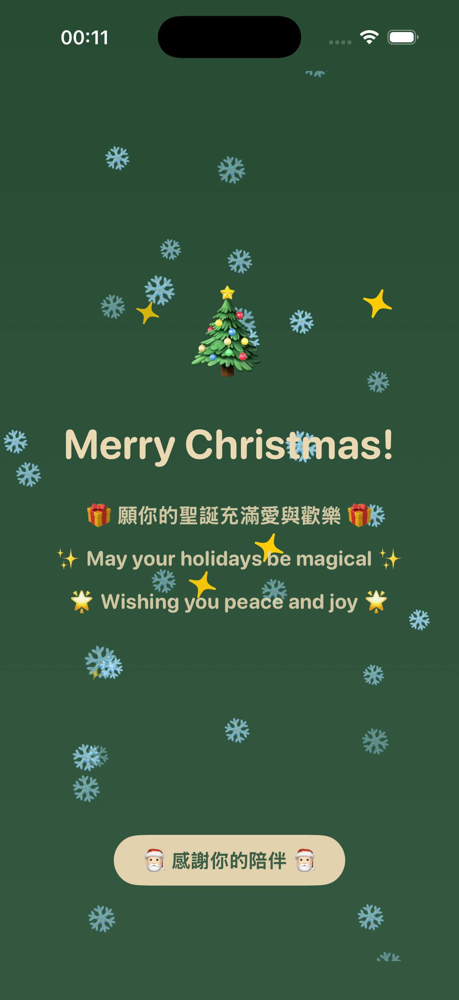
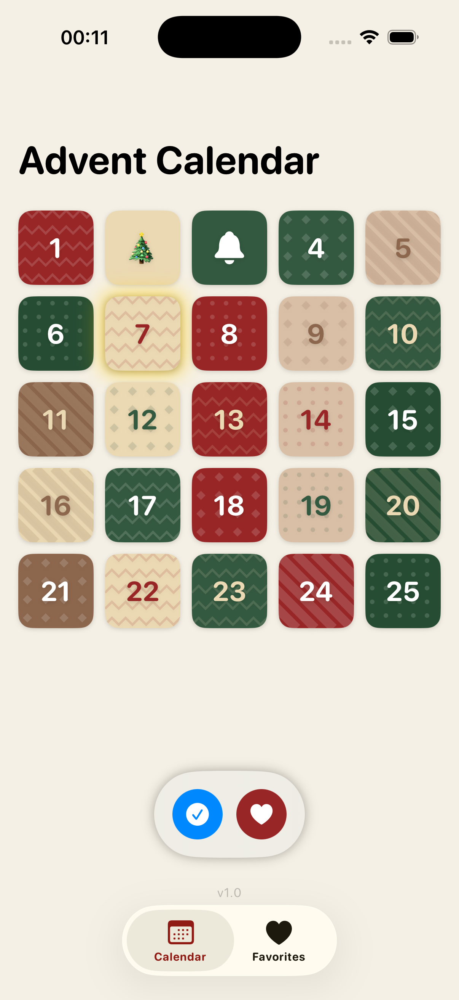

# Advent Calendar App

一個精美的聖誕節倒數日曆 iOS App，每天開啟一個驚喜影片！

## 功能特色

- 25 天倒數日曆，每天一個驚喜
- 精美的聖誕主題設計（紅、綠、奶油色系）
- 開禮物動畫效果
- 影片播放器（支援播放/暫停、收藏、分享）
- 收藏功能
- 當日格子發光提示
- 全部開啟後顯示聖誕快樂慶祝畫面
- 持續飄落的雪花動畫

## 截圖

| 日曆首頁 | 開禮物動畫 | 影片播放器 |
|:---:|:---:|:---:|
|  |  |  |

| 收藏頁面 | 聖誕慶祝 | Debug 模式 |
|:---:|:---:|:---:|
|  |  |  |

## 環境需求

- **Xcode**: 16.0+
- **iOS**: 26.0+
- **Swift**: 5.0+
- **macOS**: Sequoia 15.0+


## 專案結構

```
Demo/
├── DemoApp.swift              # App 入口
├── Models/
│   ├── AdventDay.swift        # 日曆資料模型 (SwiftData)
│   └── VideoData.swift        # 影片資料模型與載入器
├── Resources/
│   └── videos.json            # 25 天影片連結資料
├── Theme/
│   ├── AppColors.swift        # 統一色彩定義
│   ├── AppFonts.swift         # 統一字型定義 (System Rounded)
│   ├── CellStyles.swift       # 格子樣式與圖示
│   └── Patterns.swift         # 背景圖案 (dots, stripes, zigzag, diamonds)
└── Views/
    ├── MainTabView.swift              # 主頁 TabView
    ├── AdventCalendarView.swift       # 日曆主頁
    ├── AdventDayCell.swift            # 日曆格子元件
    ├── FavoritesView.swift            # 收藏頁面
    ├── VideoPlayerView.swift          # 影片播放器
    ├── GiftOpeningView.swift          # 開禮物動畫
    ├── ChristmasBannerView.swift      # 聖誕橫幅
    ├── ChristmasCelebrationView.swift # 聖誕慶祝全螢幕
    └── DebugPanelView.swift           # Debug 控制面板
```

## Debug 模式

Debug 模式可以讓開發者快速測試各種狀態。

### 啟用方式

1. 在日曆首頁，找到底部的版本號 `v1.0`
2. **連續點擊 5 次**版本號
3. 底部會出現 Debug 控制面板

### Debug 功能

| 按鈕 | 功能 |
|:---|:---|
| Open All / Close All | 開啟/關閉所有日期 |
| Favorite All / Unfavorite All | 將所有日期加入/移除收藏 |

### 注意事項

- Debug 模式下，可以開啟任何日期（忽略日期限制）
- 再次點擊版本號 5 次可關閉 Debug 模式

## 技術細節

### 使用的框架

- **SwiftUI** - UI 框架
- **SwiftData** - Database
- **AVKit** - 影片播放

### 特色實作

- `TimelineView` + `Canvas` 實現持續飄落的雪花
- 自訂 `AVPlayerViewController` 隱藏預設控制項
- Spring 動畫實現開禮物效果
- `@Query` 搭配 `#Predicate` 實現收藏篩選

### 色彩主題

| 名稱 | 用途 |
|:---|:---|
| Christmas Red | 主要強調色 |
| Forest Green | 次要強調色 |
| Dark Green | 深色背景 |
| Cream | 淺色文字/背景 |
| Beige | 輔助色 |
| Warm Brown | 輔助色 |

## 授權

MIT License
